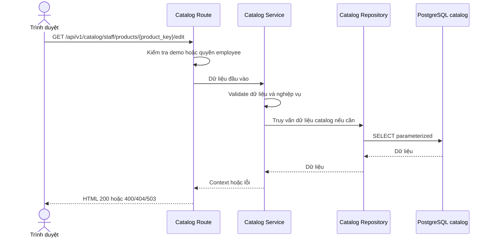

# C09: GET /api/v1/catalog/staff/products/{product_key}/edit

Endpoint trả HTML; vai trò Nhân viên cho đường dẫn staff. CATALOG_DEMO=true bỏ đăng nhập chỉ trong môi trường demo.

```mermaid
sequenceDiagram
    actor Browser as Trình duyệt
    participant Route as Catalog Route
    participant Service as Catalog Service
    participant Repository as Catalog Repository
    participant DB as PostgreSQL catalog
    Browser->>Route: GET /api/v1/catalog/staff/products/{product_key}/edit
    Route->>Route: Kiểm tra demo hoặc quyền employee
    Route->>Service: Dữ liệu đầu vào
    Service->>Service: Validate dữ liệu và nghiệp vụ
    Service->>Repository: Truy vấn dữ liệu catalog nếu cần
    Repository->>DB: SELECT parameterized
    DB-->>Repository: Dữ liệu
    Repository-->>Service: Dữ liệu
    Service-->>Route: Context hoặc lỗi
    Route-->>Browser: HTML 200 hoặc 400/404/503
```
