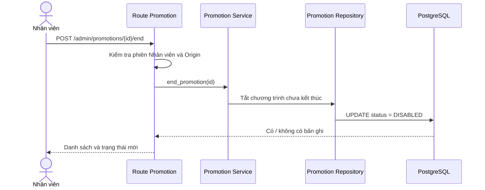

# UC-28 / UC-29 / UC-30 — Kết thúc chương trình

```mermaid
sequenceDiagram
    actor NV as Nhân viên
    participant R as Route Promotion
    participant S as Promotion Service
    participant P as Promotion Repository
    participant DB as PostgreSQL
    NV->>R: POST /admin/promotions/{id}/end
    R->>R: Kiểm tra phiên Nhân viên và Origin
    R->>S: end_promotion(id)
    S->>P: Tắt chương trình chưa kết thúc
    P->>DB: UPDATE status = DISABLED
    DB-->>R: Có / không có bản ghi
    R-->>NV: Danh sách và trạng thái mới
```
