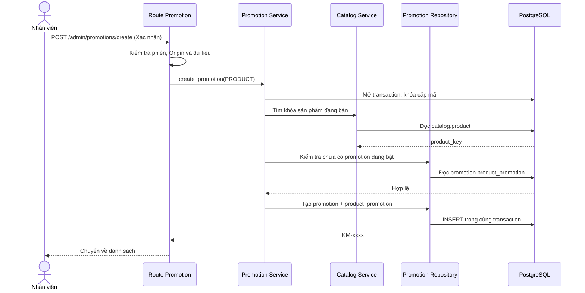

# UC-28 — Tạo khuyến mãi sản phẩm

```mermaid
sequenceDiagram
    actor NV as Nhân viên
    participant R as Route Promotion
    participant S as Promotion Service
    participant C as Catalog Service
    participant P as Promotion Repository
    participant DB as PostgreSQL
    NV->>R: POST /admin/promotions/create (Xác nhận)
    R->>R: Kiểm tra phiên, Origin và dữ liệu
    R->>S: create_promotion(PRODUCT)
    S->>DB: Mở transaction, khóa cấp mã
    S->>C: Tìm khóa sản phẩm đang bán
    C->>DB: Đọc catalog.product
    DB-->>C: product_key
    S->>P: Kiểm tra chưa có promotion đang bật
    P->>DB: Đọc promotion.product_promotion
    DB-->>S: Hợp lệ
    S->>P: Tạo promotion + product_promotion
    P->>DB: INSERT trong cùng transaction
    DB-->>R: KM-xxxx
    R-->>NV: Chuyển về danh sách
```
