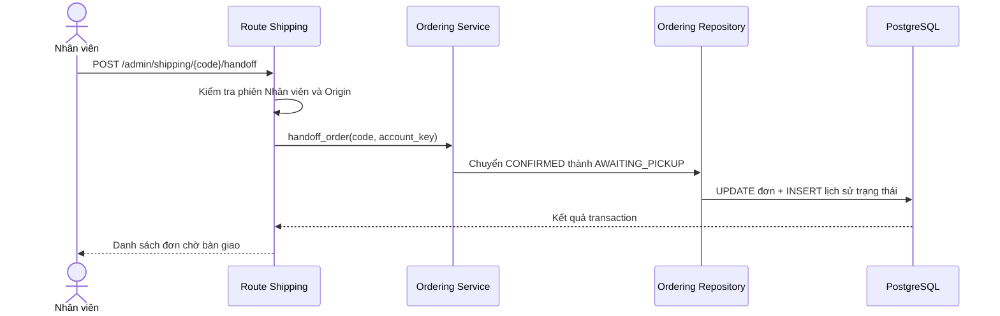

# UC-40 — Bàn giao đơn vận chuyển

```mermaid
sequenceDiagram
    actor NV as Nhân viên
    participant R as Route Shipping
    participant O as Ordering Service
    participant P as Ordering Repository
    participant DB as PostgreSQL
    NV->>R: POST /admin/shipping/{code}/handoff
    R->>R: Kiểm tra phiên Nhân viên và Origin
    R->>O: handoff_order(code, account_key)
    O->>P: Chuyển CONFIRMED thành AWAITING_PICKUP
    P->>DB: UPDATE đơn + INSERT lịch sử trạng thái
    DB-->>R: Kết quả transaction
    R-->>NV: Danh sách đơn chờ bàn giao
```
