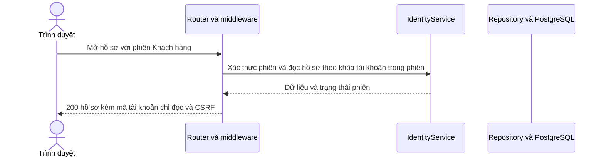

# GET /account/profile

UC-04 · Xem hồ sơ của mình.

```mermaid
sequenceDiagram
    actor Browser as Trình duyệt
    participant Route as Router và middleware
    participant Service as IdentityService
    participant Data as Repository và PostgreSQL
    Browser->>Route: Mở hồ sơ với phiên Khách hàng
    Route->>Service: Xác thực phiên và đọc hồ sơ theo khóa tài khoản trong phiên
    Service-->>Route: Dữ liệu và trạng thái phiên
    Route-->>Browser: 200 hồ sơ kèm mã tài khoản chỉ đọc và CSRF
```
