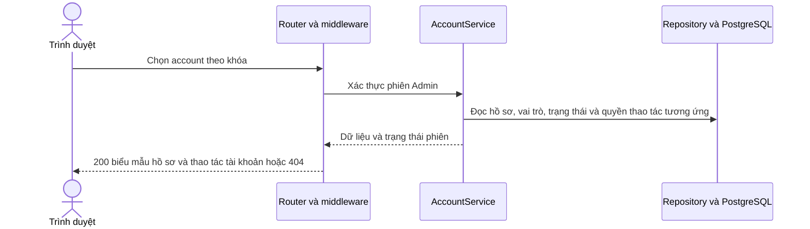

# GET /admin/accounts/{key}/edit

UC-04/07/08 · Mở chi tiết quản trị.

```mermaid
sequenceDiagram
    actor Browser as Trình duyệt
    participant Route as Router và middleware
    participant Service as AccountService
    participant Data as Repository và PostgreSQL
    Browser->>Route: Chọn account theo khóa
    Route->>Service: Xác thực phiên Admin
    Service->>Data: Đọc hồ sơ, vai trò, trạng thái và quyền thao tác tương ứng
    Service-->>Route: Dữ liệu và trạng thái phiên
    Route-->>Browser: 200 biểu mẫu hồ sơ và thao tác tài khoản hoặc 404
```
