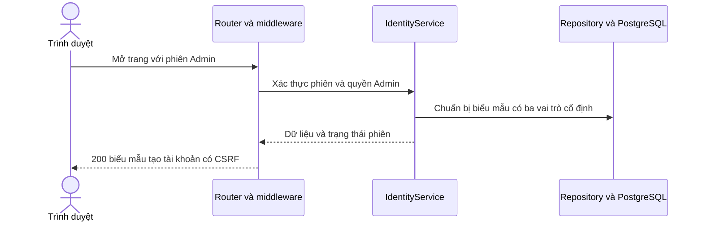

# GET /admin/accounts/new

UC-06 · Mở form tạo tài khoản.

```mermaid
sequenceDiagram
    actor Browser as Trình duyệt
    participant Route as Router và middleware
    participant Service as IdentityService
    participant Data as Repository và PostgreSQL
    Browser->>Route: Mở trang với phiên Admin
    Route->>Service: Xác thực phiên và quyền Admin
    Service->>Data: Chuẩn bị biểu mẫu có ba vai trò cố định
    Service-->>Route: Dữ liệu và trạng thái phiên
    Route-->>Browser: 200 biểu mẫu tạo tài khoản có CSRF
```
