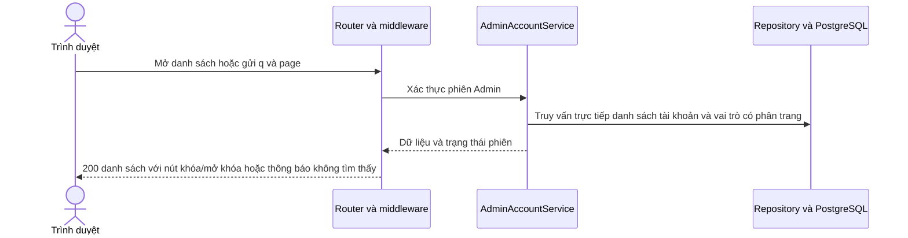

# GET /api/v1/identity/portal/accounts

UC-07 và UC-08 · Danh sách, tìm kiếm và điểm vào khóa/mở khóa cho Admin.

```mermaid
sequenceDiagram
    actor Browser as Trình duyệt
    participant Route as Router và middleware
    participant Service as AdminAccountService
    participant Data as Repository và PostgreSQL
    Browser->>Route: Mở danh sách hoặc gửi q và page
    Route->>Service: Xác thực phiên Admin
    Service->>Data: Truy vấn trực tiếp danh sách tài khoản và vai trò có phân trang
    Service-->>Route: Dữ liệu và trạng thái phiên
    Route-->>Browser: 200 danh sách với nút khóa/mở khóa hoặc thông báo không tìm thấy
```
