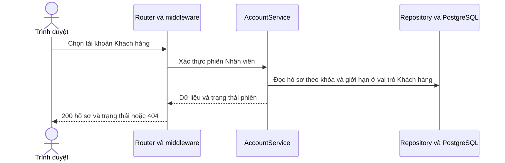

# GET /admin/customers/{key}

UC-07 · Chi tiết khách cho Nhân viên.

```mermaid
sequenceDiagram
    actor Browser as Trình duyệt
    participant Route as Router và middleware
    participant Service as AccountService
    participant Data as Repository và PostgreSQL
    Browser->>Route: Chọn tài khoản Khách hàng
    Route->>Service: Xác thực phiên Nhân viên
    Service->>Data: Đọc hồ sơ theo khóa và giới hạn ở vai trò Khách hàng
    Service-->>Route: Dữ liệu và trạng thái phiên
    Route-->>Browser: 200 hồ sơ và trạng thái hoặc 404
```
