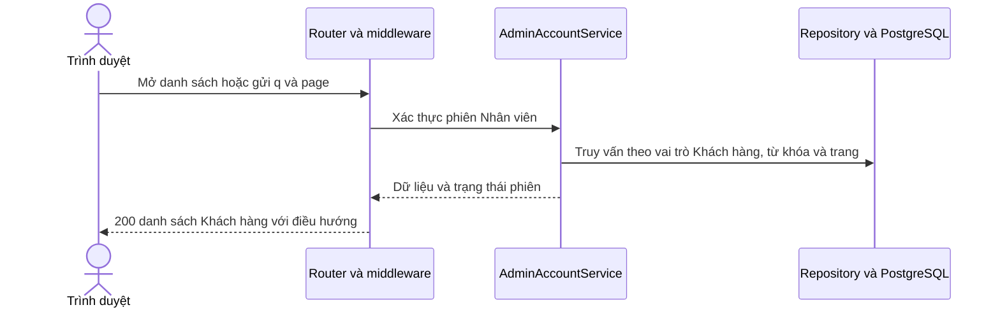

# GET /admin/customers

UC-07 · Danh sách khách cho Nhân viên.

```mermaid
sequenceDiagram
    actor Browser as Trình duyệt
    participant Route as Router và middleware
    participant Service as AdminAccountService
    participant Data as Repository và PostgreSQL
    Browser->>Route: Mở danh sách hoặc gửi q và page
    Route->>Service: Xác thực phiên Nhân viên
    Service->>Data: Truy vấn theo vai trò Khách hàng, từ khóa và trang
    Service-->>Route: Dữ liệu và trạng thái phiên
    Route-->>Browser: 200 danh sách Khách hàng với điều hướng
```
