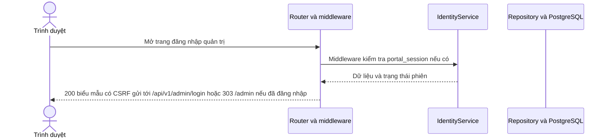

# GET /api/v1/admin/login

UC-02 · Hiển thị đăng nhập portal.

```mermaid
sequenceDiagram
    actor Browser as Trình duyệt
    participant Route as Router và middleware
    participant Service as IdentityService
    participant Data as Repository và PostgreSQL
    Browser->>Route: Mở trang đăng nhập quản trị
    Route->>Service: Middleware kiểm tra portal_session nếu có
    Service-->>Route: Dữ liệu và trạng thái phiên
    Route-->>Browser: 200 biểu mẫu có CSRF gửi tới /api/v1/admin/login hoặc 303 /admin nếu đã đăng nhập
```
