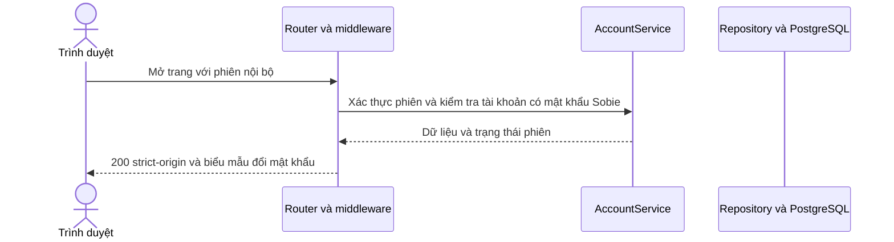

# GET /admin/password

UC-05 · Form đổi mật khẩu portal.

```mermaid
sequenceDiagram
    actor Browser as Trình duyệt
    participant Route as Router và middleware
    participant Service as AccountService
    participant Data as Repository và PostgreSQL
    Browser->>Route: Mở trang với phiên nội bộ
    Route->>Service: Xác thực phiên và kiểm tra tài khoản có mật khẩu Sobie
    Service-->>Route: Dữ liệu và trạng thái phiên
    Route-->>Browser: 200 strict-origin và biểu mẫu đổi mật khẩu
```
