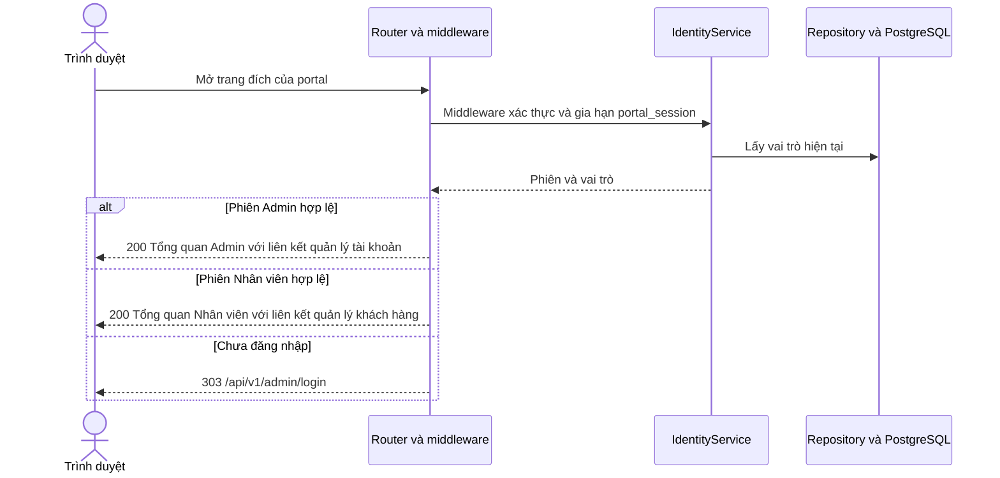

# GET /admin

UC-02 · Trang đích portal.

```mermaid
sequenceDiagram
    actor Browser as Trình duyệt
    participant Route as Router và middleware
    participant Service as IdentityService
    participant Data as Repository và PostgreSQL
    Browser->>Route: Mở trang đích của portal
    Route->>Service: Middleware xác thực và gia hạn portal_session
    Service->>Data: Lấy vai trò hiện tại
    Service-->>Route: Phiên và vai trò
    alt Phiên Admin hợp lệ
        Route-->>Browser: 200 Tổng quan Admin với liên kết quản lý tài khoản
    else Phiên Nhân viên hợp lệ
        Route-->>Browser: 200 Tổng quan Nhân viên với liên kết quản lý khách hàng
    else Chưa đăng nhập
        Route-->>Browser: 303 /api/v1/admin/login
    end
```
