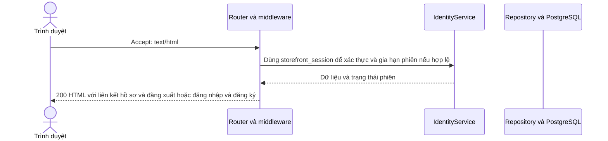

# GET /

UC-02/03 · Điều hướng storefront.

```mermaid
sequenceDiagram
    actor Browser as Trình duyệt
    participant Route as Router và middleware
    participant Service as IdentityService
    participant Data as Repository và PostgreSQL
    Browser->>Route: Accept: text/html
    Route->>Service: Dùng storefront_session để xác thực và gia hạn phiên nếu hợp lệ
    Service-->>Route: Dữ liệu và trạng thái phiên
    Route-->>Browser: 200 HTML với liên kết hồ sơ và đăng xuất hoặc đăng nhập và đăng ký
```
