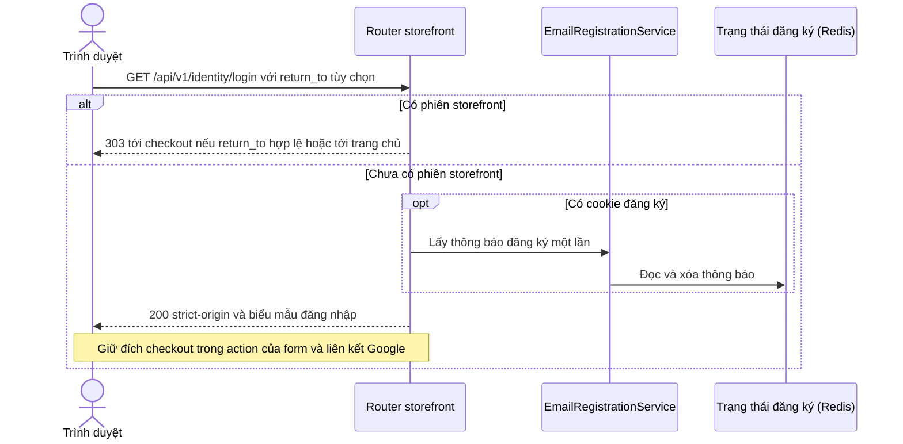

# GET /api/v1/identity/login

Đích chuyển trang sau khi đăng ký bằng email ở UC-01 Main 8. Điểm vào đăng nhập bằng mật khẩu và Google của UC-02.

```mermaid
sequenceDiagram
    actor Browser as Trình duyệt
    participant Route as Router storefront
    participant Registration as EmailRegistrationService
    participant Redis as Trạng thái đăng ký (Redis)
    Browser->>Route: GET /api/v1/identity/login với return_to tùy chọn
    alt Có phiên storefront
        Route-->>Browser: 303 tới checkout nếu return_to hợp lệ hoặc tới trang chủ
    else Chưa có phiên storefront
        opt Có cookie đăng ký
            Route->>Registration: Lấy thông báo đăng ký một lần
            Registration->>Redis: Đọc và xóa thông báo
        end
        Route-->>Browser: 200 strict-origin và biểu mẫu đăng nhập
        Note over Browser,Route: Giữ đích checkout trong action của form và liên kết Google
    end
```
