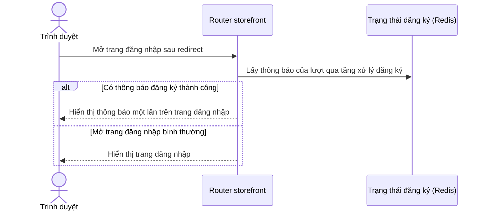

# GET /login

Đích chuyển trang của UC-01 Main 8 và 1b.5.

```mermaid
sequenceDiagram
    actor Browser as Trình duyệt
    participant Route as Router storefront
    participant Redis as Trạng thái đăng ký (Redis)
    Browser->>Route: Mở trang đăng nhập sau redirect
    Route->>Redis: Lấy thông báo của lượt qua tầng xử lý đăng ký
    alt Có thông báo đăng ký thành công
        Route-->>Browser: Hiển thị thông báo một lần trên trang đăng nhập
    else Mở trang đăng nhập bình thường
        Route-->>Browser: Hiển thị trang đăng nhập
    end
```
