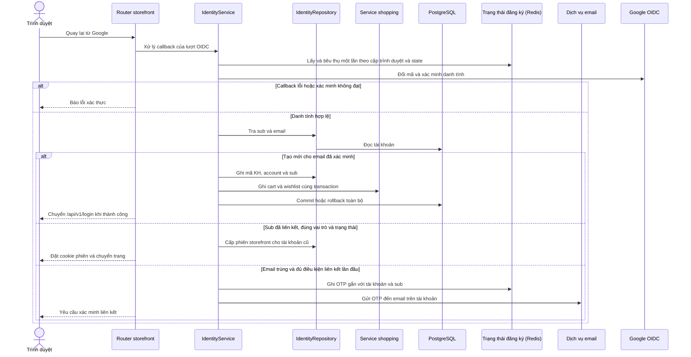

# GET /register/google/callback

UC-01 1b.2–5, E1, E6, E8.

```mermaid
sequenceDiagram
    actor Browser as Trình duyệt
    participant Route as Router storefront
    participant Service as IdentityService
    participant Repo as IdentityRepository
    participant Shopping as Service shopping
    participant DB as PostgreSQL
    participant Redis as Trạng thái đăng ký (Redis)
    participant Mail as Dịch vụ email
    participant Google as Google OIDC
    Browser->>Route: Quay lại từ Google
    Route->>Service: Xử lý callback của lượt OIDC
    Service->>Redis: Lấy và tiêu thụ một lần theo cặp trình duyệt và state
    Service->>Google: Đổi mã và xác minh danh tính
    alt Callback lỗi hoặc xác minh không đạt
        Route-->>Browser: Báo lỗi xác thực
    else Danh tính hợp lệ
        Service->>Repo: Tra sub và email
        Repo->>DB: Đọc tài khoản
        alt Tạo mới cho email đã xác minh
            Service->>Repo: Ghi mã KH, account và sub
            Service->>Shopping: Ghi cart và wishlist cùng transaction
            Service->>DB: Commit hoặc rollback toàn bộ
            Route-->>Browser: Chuyển /api/v1/login khi thành công
        else Sub đã liên kết, đúng vai trò và trạng thái
            Service->>Repo: Cấp phiên storefront cho tài khoản cũ
            Route-->>Browser: Đặt cookie phiên và chuyển trang
        else Email trùng và đủ điều kiện liên kết lần đầu
            Service->>Redis: Ghi OTP gắn với tài khoản và sub
            Service->>Mail: Gửi OTP đến email trên tài khoản
            Route-->>Browser: Yêu cầu xác minh liên kết
        end
    end
```
