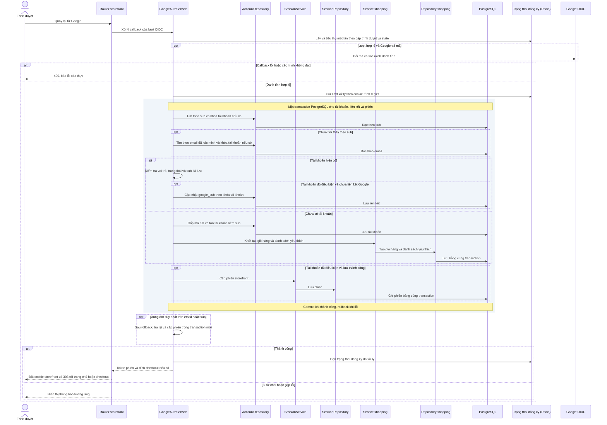

# GET /api/v1/identity/register/google/callback

UC-01 1b.2–5, E1, E6, E8 và UC-02 1c, 1d, AC-7.

```mermaid
sequenceDiagram
    actor Browser as Trình duyệt
    participant Route as Router storefront
    participant Service as GoogleAuthService
    participant Repo as AccountRepository
    participant Sessions as SessionService
    participant SessionRepo as SessionRepository
    participant Shopping as Service shopping
    participant ShoppingRepo as Repository shopping
    participant DB as PostgreSQL
    participant Redis as Trạng thái đăng ký (Redis)
    participant Google as Google OIDC
    Browser->>Route: Quay lại từ Google
    Route->>Service: Xử lý callback của lượt OIDC
    Service->>Redis: Lấy và tiêu thụ một lần theo cặp trình duyệt và state
    opt Lượt hợp lệ và Google trả mã
        Service->>Google: Đổi mã và xác minh danh tính
    end
    alt Callback lỗi hoặc xác minh không đạt
        Route-->>Browser: 400, báo lỗi xác thực
    else Danh tính hợp lệ
        Service->>Redis: Giữ lượt xử lý theo cookie trình duyệt
        rect rgb(240, 245, 250)
            Note over Service,DB: Một transaction PostgreSQL cho tài khoản, liên kết và phiên
            Service->>Repo: Tìm theo sub và khóa tài khoản nếu có
            Repo->>DB: Đọc theo sub
            opt Chưa tìm thấy theo sub
                Service->>Repo: Tìm theo email đã xác minh và khóa tài khoản nếu có
                Repo->>DB: Đọc theo email
            end
            alt Tài khoản hiện có
                Service->>Service: Kiểm tra vai trò, trạng thái và sub đã lưu
                opt Tài khoản đủ điều kiện và chưa liên kết Google
                    Service->>Repo: Cập nhật google_sub theo khóa tài khoản
                    Repo->>DB: Lưu liên kết
                end
            else Chưa có tài khoản
                Service->>Repo: Cấp mã KH và tạo tài khoản kèm sub
                Repo->>DB: Lưu tài khoản
                Service->>Shopping: Khởi tạo giỏ hàng và danh sách yêu thích
                Shopping->>ShoppingRepo: Tạo giỏ hàng và danh sách yêu thích
                ShoppingRepo->>DB: Lưu bằng cùng transaction
            end
            opt Tài khoản đủ điều kiện và lưu thành công
                Service->>Sessions: Cấp phiên storefront
                Sessions->>SessionRepo: Lưu phiên
                SessionRepo->>DB: Ghi phiên bằng cùng transaction
            end
            Note over Service,DB: Commit khi thành công, rollback khi lỗi
        end
        opt Xung đột duy nhất trên email hoặc sub
            Service->>Service: Sau rollback, tra lại và cấp phiên trong transaction mới
        end
        alt Thành công
            Service->>Redis: Dọn trạng thái đăng ký đã xử lý
            Service-->>Route: Token phiên và đích checkout nếu có
            Route-->>Browser: Đặt cookie storefront và 303 tới trang chủ hoặc checkout
        else Bị từ chối hoặc gặp lỗi
            Route-->>Browser: Hiển thị thông báo tương ứng
        end
    end
```
