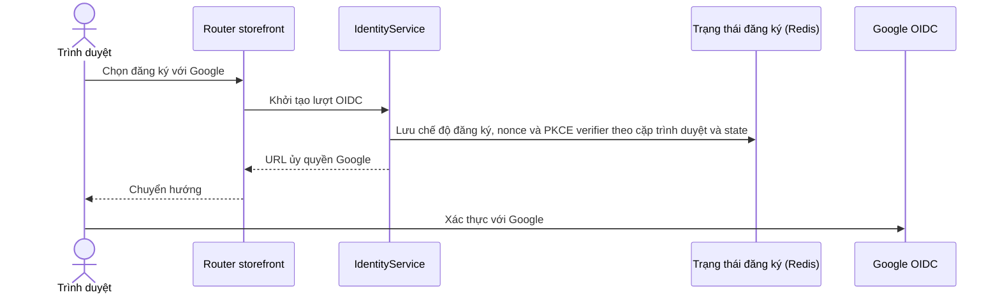

# GET /register/google

UC-01 1b.1.

```mermaid
sequenceDiagram
    actor Browser as Trình duyệt
    participant Route as Router storefront
    participant Service as IdentityService
    participant Redis as Trạng thái đăng ký (Redis)
    participant Google as Google OIDC
    Browser->>Route: Chọn đăng ký với Google
    Route->>Service: Khởi tạo lượt OIDC
    Service->>Redis: Lưu chế độ đăng ký, nonce và PKCE verifier theo cặp trình duyệt và state
    Service-->>Route: URL ủy quyền Google
    Route-->>Browser: Chuyển hướng
    Browser->>Google: Xác thực với Google
```
