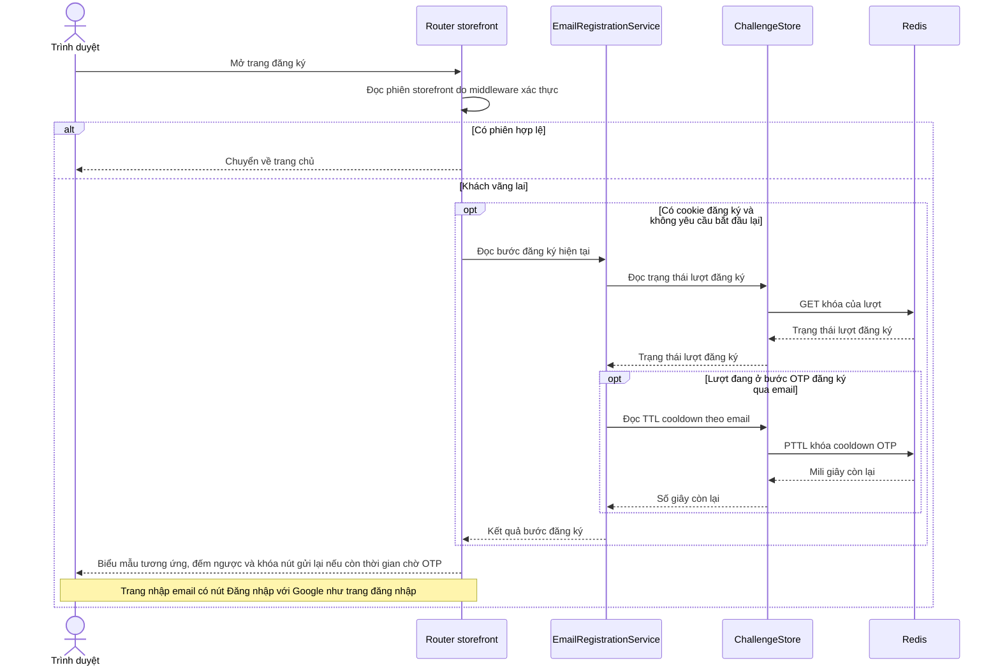

# GET /api/v1/identity/register

UC-01 Main 1, 1a, AC-18.

```mermaid
sequenceDiagram
    actor Browser as Trình duyệt
    participant Route as Router storefront
    participant Service as EmailRegistrationService
    participant Store as ChallengeStore
    participant Redis as Redis
    Browser->>Route: Mở trang đăng ký
    Route->>Route: Đọc phiên storefront do middleware xác thực
    alt Có phiên hợp lệ
        Route-->>Browser: Chuyển về trang chủ
    else Khách vãng lai
        opt Có cookie đăng ký và không yêu cầu bắt đầu lại
            Route->>Service: Đọc bước đăng ký hiện tại
            Service->>Store: Đọc trạng thái lượt đăng ký
            Store->>Redis: GET khóa của lượt
            Redis-->>Store: Trạng thái lượt đăng ký
            Store-->>Service: Trạng thái lượt đăng ký
            opt Lượt đang ở bước OTP đăng ký qua email
                Service->>Store: Đọc TTL cooldown theo email
                Store->>Redis: PTTL khóa cooldown OTP
                Redis-->>Store: Mili giây còn lại
                Store-->>Service: Số giây còn lại
            end
            Service-->>Route: Kết quả bước đăng ký
        end
        Route-->>Browser: Biểu mẫu tương ứng, đếm ngược và khóa nút gửi lại nếu còn thời gian chờ OTP
        Note over Browser,Route: Trang nhập email có nút Đăng nhập với Google như trang đăng nhập
    end
```
