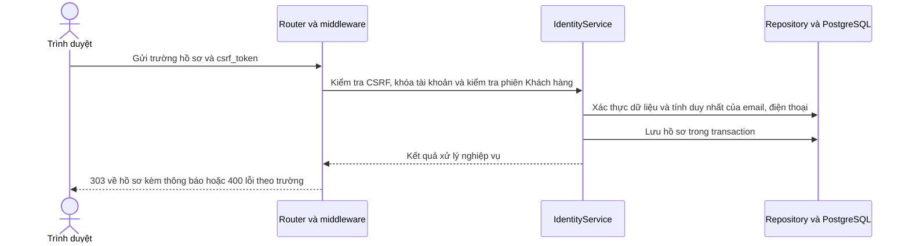

# POST /account/profile

UC-04 · Lưu hồ sơ của mình.

```mermaid
sequenceDiagram
    actor Browser as Trình duyệt
    participant Route as Router và middleware
    participant Service as IdentityService
    participant Data as Repository và PostgreSQL
    Browser->>Route: Gửi trường hồ sơ và csrf_token
    Route->>Service: Kiểm tra CSRF, khóa tài khoản và kiểm tra phiên Khách hàng
    Service->>Data: Xác thực dữ liệu và tính duy nhất của email, điện thoại
    Service->>Data: Lưu hồ sơ trong transaction
    Service-->>Route: Kết quả xử lý nghiệp vụ
    Route-->>Browser: 303 về hồ sơ kèm thông báo hoặc 400 lỗi theo trường
```
