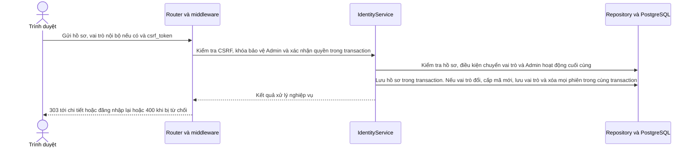

# POST /admin/accounts/{key}/edit

UC-04/07 · Lưu hồ sơ và vai trò trong một lần gửi.

```mermaid
sequenceDiagram
    actor Browser as Trình duyệt
    participant Route as Router và middleware
    participant Service as IdentityService
    participant Data as Repository và PostgreSQL
    Browser->>Route: Gửi hồ sơ, vai trò nội bộ nếu có và csrf_token
    Route->>Service: Kiểm tra CSRF, khóa bảo vệ Admin và xác nhận quyền trong transaction
    Service->>Data: Kiểm tra hồ sơ, điều kiện chuyển vai trò và Admin hoạt động cuối cùng
    Service->>Data: Lưu hồ sơ trong transaction. Nếu vai trò đổi, cấp mã mới, lưu vai trò và xóa mọi phiên trong cùng transaction
    Service-->>Route: Kết quả xử lý nghiệp vụ
    Route-->>Browser: 303 tới chi tiết hoặc đăng nhập lại hoặc 400 khi bị từ chối
```
