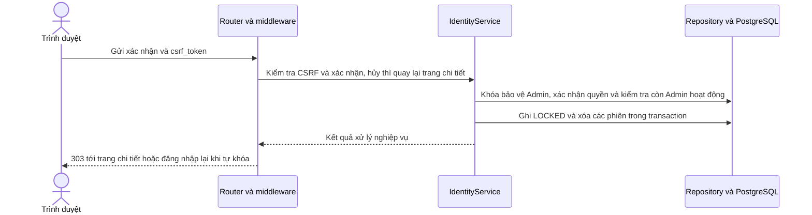

# POST /admin/accounts/{key}/lock

UC-08 · Khóa tài khoản.

```mermaid
sequenceDiagram
    actor Browser as Trình duyệt
    participant Route as Router và middleware
    participant Service as IdentityService
    participant Data as Repository và PostgreSQL
    Browser->>Route: Gửi xác nhận và csrf_token
    Route->>Service: Kiểm tra CSRF và xác nhận, hủy thì quay lại trang chi tiết
    Service->>Data: Khóa bảo vệ Admin, xác nhận quyền và kiểm tra còn Admin hoạt động
    Service->>Data: Ghi LOCKED và xóa các phiên trong transaction
    Service-->>Route: Kết quả xử lý nghiệp vụ
    Route-->>Browser: 303 tới trang chi tiết hoặc đăng nhập lại khi tự khóa
```
