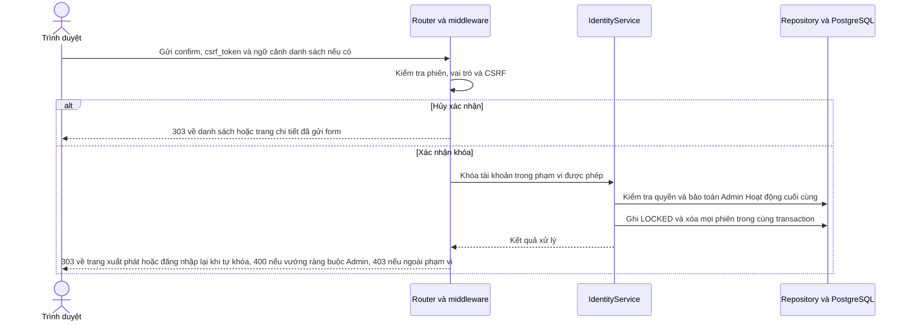

# POST /api/v1/identity/portal/accounts/{account_key}/lock

UC-08 · Khóa tài khoản.

```mermaid
sequenceDiagram
    actor Browser as Trình duyệt
    participant Route as Router và middleware
    participant Service as IdentityService
    participant Data as Repository và PostgreSQL
    Browser->>Route: Gửi confirm, csrf_token và ngữ cảnh danh sách nếu có
    Route->>Route: Kiểm tra phiên, vai trò và CSRF
    alt Hủy xác nhận
        Route-->>Browser: 303 về danh sách hoặc trang chi tiết đã gửi form
    else Xác nhận khóa
        Route->>Service: Khóa tài khoản trong phạm vi được phép
        Service->>Data: Kiểm tra quyền và bảo toàn Admin Hoạt động cuối cùng
        Service->>Data: Ghi LOCKED và xóa mọi phiên trong cùng transaction
        Service-->>Route: Kết quả xử lý
        Route-->>Browser: 303 về trang xuất phát hoặc đăng nhập lại khi tự khóa, 400 nếu vướng ràng buộc Admin, 403 nếu ngoài phạm vi
    end
```
