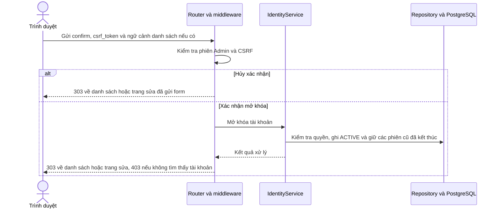

# POST /api/v1/identity/portal/accounts/{account_key}/unlock

UC-08 · Mở khóa tài khoản.

```mermaid
sequenceDiagram
    actor Browser as Trình duyệt
    participant Route as Router và middleware
    participant Service as IdentityService
    participant Data as Repository và PostgreSQL
    Browser->>Route: Gửi confirm, csrf_token và ngữ cảnh danh sách nếu có
    Route->>Route: Kiểm tra phiên Admin và CSRF
    alt Hủy xác nhận
        Route-->>Browser: 303 về danh sách hoặc trang sửa đã gửi form
    else Xác nhận mở khóa
        Route->>Service: Mở khóa tài khoản
        Service->>Data: Kiểm tra quyền, ghi ACTIVE và giữ các phiên cũ đã kết thúc
        Service-->>Route: Kết quả xử lý
        Route-->>Browser: 303 về danh sách hoặc trang sửa, 403 nếu không tìm thấy tài khoản
    end
```
