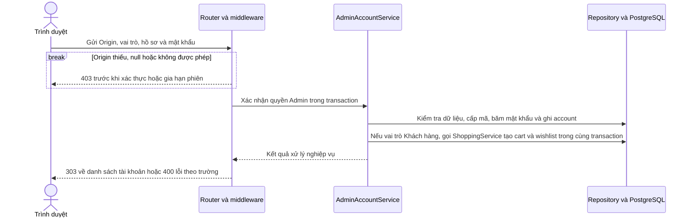

# POST /admin/accounts/new

UC-06 · Tạo tài khoản.

```mermaid
sequenceDiagram
    actor Browser as Trình duyệt
    participant Route as Router và middleware
    participant Service as AdminAccountService
    participant Data as Repository và PostgreSQL
    Browser->>Route: Gửi Origin, vai trò, hồ sơ và mật khẩu
    break Origin thiếu, null hoặc không được phép
        Route-->>Browser: 403 trước khi xác thực hoặc gia hạn phiên
    end
    Route->>Service: Xác nhận quyền Admin trong transaction
    Service->>Data: Kiểm tra dữ liệu, cấp mã, băm mật khẩu và ghi account
    Service->>Data: Nếu vai trò Khách hàng, gọi ShoppingService tạo cart và wishlist trong cùng transaction
    Service-->>Route: Kết quả xử lý nghiệp vụ
    Route-->>Browser: 303 về danh sách tài khoản hoặc 400 lỗi theo trường
```
