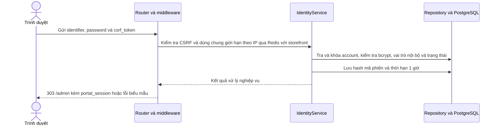

# POST /admin/login

UC-02 · Đăng nhập bằng mật khẩu portal.

```mermaid
sequenceDiagram
    actor Browser as Trình duyệt
    participant Route as Router và middleware
    participant Service as IdentityService
    participant Data as Repository và PostgreSQL
    Browser->>Route: Gửi identifier, password và csrf_token
    Route->>Service: Kiểm tra CSRF và dùng chung giới hạn theo IP qua Redis với storefront
    Service->>Data: Tra và khóa account, kiểm tra bcrypt, vai trò nội bộ và trạng thái
    Service->>Data: Lưu hash mã phiên và thời hạn 1 giờ
    Service-->>Route: Kết quả xử lý nghiệp vụ
    Route-->>Browser: 303 /admin kèm portal_session hoặc lỗi biểu mẫu
```
