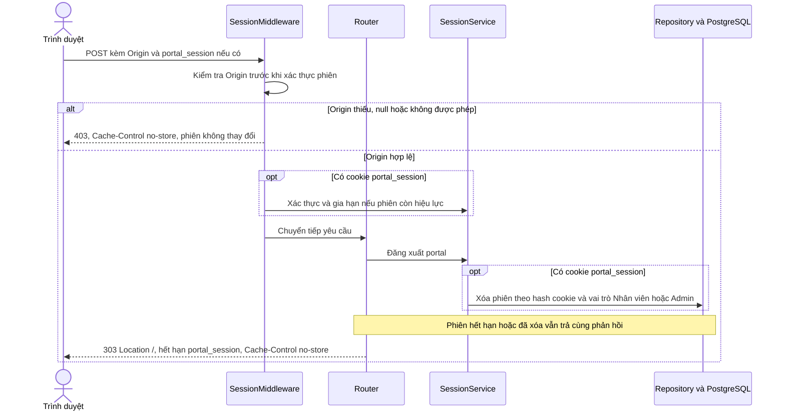

# POST /api/v1/identity/portal/logout

UC-03 · Đăng xuất portal qua form không có `csrf_token`.

```mermaid
sequenceDiagram
    actor Browser as Trình duyệt
    participant Middleware as SessionMiddleware
    participant Route as Router
    participant Service as SessionService
    participant Data as Repository và PostgreSQL
    Browser->>Middleware: POST kèm Origin và portal_session nếu có
    Middleware->>Middleware: Kiểm tra Origin trước khi xác thực phiên
    alt Origin thiếu, null hoặc không được phép
        Middleware-->>Browser: 403, Cache-Control no-store, phiên không thay đổi
    else Origin hợp lệ
        opt Có cookie portal_session
            Middleware->>Service: Xác thực và gia hạn nếu phiên còn hiệu lực
        end
        Middleware->>Route: Chuyển tiếp yêu cầu
        Route->>Service: Đăng xuất portal
        opt Có cookie portal_session
            Service->>Data: Xóa phiên theo hash cookie và vai trò Nhân viên hoặc Admin
        end
        Note over Route,Data: Phiên hết hạn hoặc đã xóa vẫn trả cùng phản hồi
        Route-->>Browser: 303 Location /, hết hạn portal_session, Cache-Control no-store
    end
```
