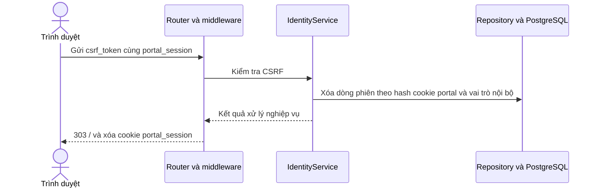

# POST /admin/logout

UC-03 · Đăng xuất portal.

```mermaid
sequenceDiagram
    actor Browser as Trình duyệt
    participant Route as Router và middleware
    participant Service as IdentityService
    participant Data as Repository và PostgreSQL
    Browser->>Route: Gửi csrf_token cùng portal_session
    Route->>Service: Kiểm tra CSRF
    Service->>Data: Xóa dòng phiên theo hash cookie portal và vai trò nội bộ
    Service-->>Route: Kết quả xử lý nghiệp vụ
    Route-->>Browser: 303 / và xóa cookie portal_session
```
