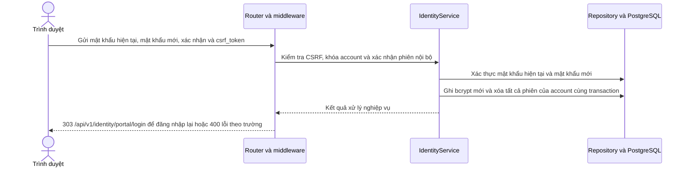

# POST /admin/password

UC-05 · Đổi mật khẩu portal.

```mermaid
sequenceDiagram
    actor Browser as Trình duyệt
    participant Route as Router và middleware
    participant Service as IdentityService
    participant Data as Repository và PostgreSQL
    Browser->>Route: Gửi mật khẩu hiện tại, mật khẩu mới, xác nhận và csrf_token
    Route->>Service: Kiểm tra CSRF, khóa account và xác nhận phiên nội bộ
    Service->>Data: Xác thực mật khẩu hiện tại và mật khẩu mới
    Service->>Data: Ghi bcrypt mới và xóa tất cả phiên của account cùng transaction
    Service-->>Route: Kết quả xử lý nghiệp vụ
    Route-->>Browser: 303 /api/v1/identity/portal/login để đăng nhập lại hoặc 400 lỗi theo trường
```
