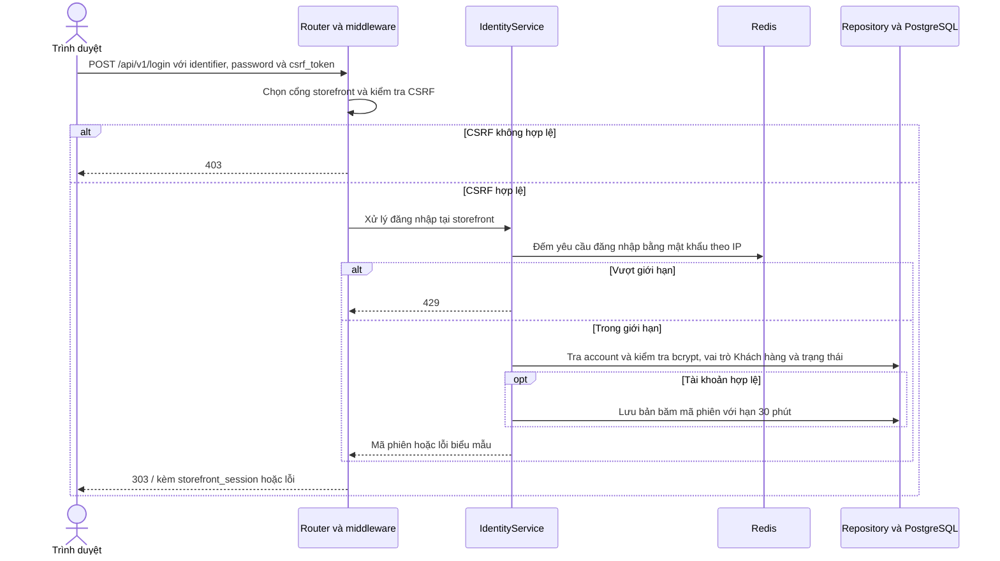

# POST /api/v1/login

UC-02 · Đăng nhập bằng mật khẩu tại storefront.

```mermaid
sequenceDiagram
    actor Browser as Trình duyệt
    participant Route as Router và middleware
    participant Service as IdentityService
    participant Redis
    participant Data as Repository và PostgreSQL
    Browser->>Route: POST /api/v1/login với identifier, password và csrf_token
    Route->>Route: Chọn cổng storefront và kiểm tra CSRF
    alt CSRF không hợp lệ
        Route-->>Browser: 403
    else CSRF hợp lệ
        Route->>Service: Xử lý đăng nhập tại storefront
        Service->>Redis: Đếm yêu cầu đăng nhập bằng mật khẩu theo IP
        alt Vượt giới hạn
            Service-->>Route: 429
        else Trong giới hạn
            Service->>Data: Tra account và kiểm tra bcrypt, vai trò Khách hàng và trạng thái
            opt Tài khoản hợp lệ
                Service->>Data: Lưu bản băm mã phiên với hạn 30 phút
            end
            Service-->>Route: Mã phiên hoặc lỗi biểu mẫu
        end
        Route-->>Browser: 303 / kèm storefront_session hoặc lỗi
    end
```
