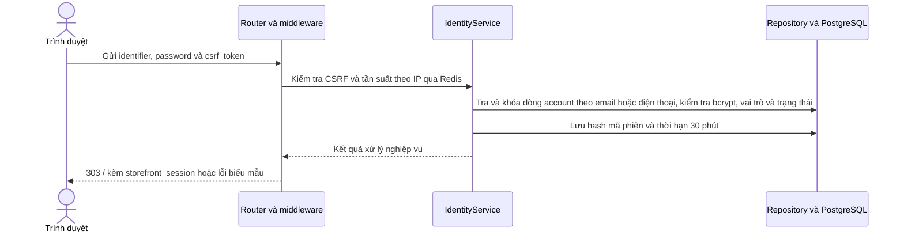

# POST /login

UC-02 · Đăng nhập bằng mật khẩu storefront.

```mermaid
sequenceDiagram
    actor Browser as Trình duyệt
    participant Route as Router và middleware
    participant Service as IdentityService
    participant Data as Repository và PostgreSQL
    Browser->>Route: Gửi identifier, password và csrf_token
    Route->>Service: Kiểm tra CSRF và tần suất theo IP qua Redis
    Service->>Data: Tra và khóa dòng account theo email hoặc điện thoại, kiểm tra bcrypt, vai trò và trạng thái
    Service->>Data: Lưu hash mã phiên và thời hạn 30 phút
    Service-->>Route: Kết quả xử lý nghiệp vụ
    Route-->>Browser: 303 / kèm storefront_session hoặc lỗi biểu mẫu
```
