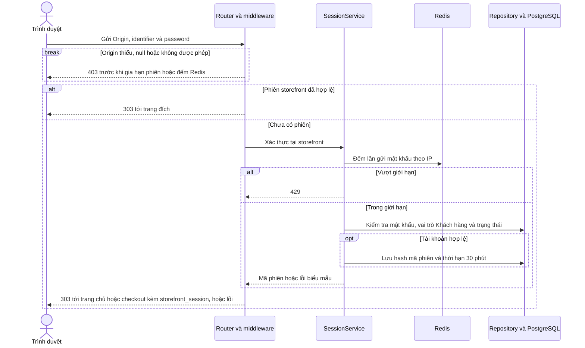

# POST /api/v1/identity/login

UC-02 · Đăng nhập bằng mật khẩu storefront.

```mermaid
sequenceDiagram
    actor Browser as Trình duyệt
    participant Route as Router và middleware
    participant Service as SessionService
    participant Redis
    participant Data as Repository và PostgreSQL
    Browser->>Route: Gửi Origin, identifier và password
    break Origin thiếu, null hoặc không được phép
        Route-->>Browser: 403 trước khi gia hạn phiên hoặc đếm Redis
    end
    alt Phiên storefront đã hợp lệ
        Route-->>Browser: 303 tới trang đích
    else Chưa có phiên
        Route->>Service: Xác thực tại storefront
        Service->>Redis: Đếm lần gửi mật khẩu theo IP
        alt Vượt giới hạn
            Service-->>Route: 429
        else Trong giới hạn
            Service->>Data: Kiểm tra mật khẩu, vai trò Khách hàng và trạng thái
            opt Tài khoản hợp lệ
                Service->>Data: Lưu hash mã phiên và thời hạn 30 phút
            end
            Service-->>Route: Mã phiên hoặc lỗi biểu mẫu
        end
        Route-->>Browser: 303 tới trang chủ hoặc checkout kèm storefront_session, hoặc lỗi
    end
```
