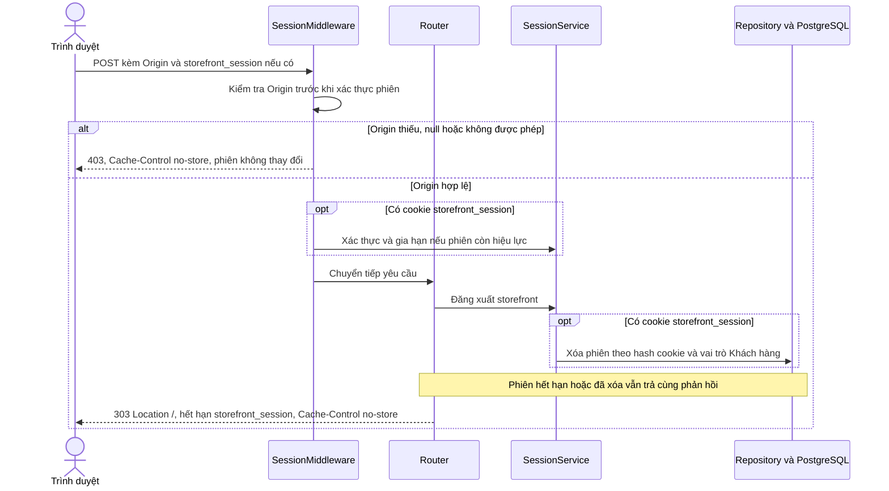

# POST /api/v1/identity/logout

UC-03 · Đăng xuất storefront qua form; chống CSRF bằng `SameSite=Lax` và Origin, không dùng CSRF token.

```mermaid
sequenceDiagram
    actor Browser as Trình duyệt
    participant Middleware as SessionMiddleware
    participant Route as Router
    participant Service as SessionService
    participant Data as Repository và PostgreSQL
    Browser->>Middleware: POST kèm Origin và storefront_session nếu có
    Middleware->>Middleware: Kiểm tra Origin trước khi xác thực phiên
    alt Origin thiếu, null hoặc không được phép
        Middleware-->>Browser: 403, Cache-Control no-store, phiên không thay đổi
    else Origin hợp lệ
        opt Có cookie storefront_session
            Middleware->>Service: Xác thực và gia hạn nếu phiên còn hiệu lực
        end
        Middleware->>Route: Chuyển tiếp yêu cầu
        Route->>Service: Đăng xuất storefront
        opt Có cookie storefront_session
            Service->>Data: Xóa phiên theo hash cookie và vai trò Khách hàng
        end
        Note over Route,Data: Phiên hết hạn hoặc đã xóa vẫn trả cùng phản hồi
        Route-->>Browser: 303 Location /, hết hạn storefront_session, Cache-Control no-store
    end
```
