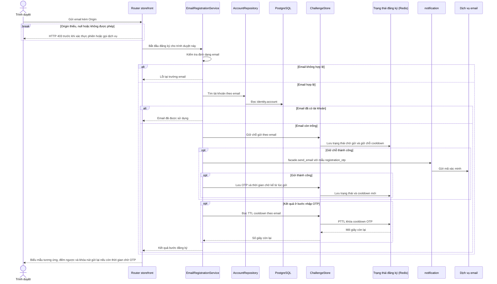

# POST /api/v1/identity/register/email

UC-01 Main 2–3, E1, E3, AC-18.

```mermaid
sequenceDiagram
    actor Browser as Trình duyệt
    participant Route as Router storefront
    participant Service as EmailRegistrationService
    participant Repo as AccountRepository
    participant DB as PostgreSQL
    participant Store as ChallengeStore
    participant Redis as Trạng thái đăng ký (Redis)
    participant Notification as notification
    participant Mail as Dịch vụ email
    Browser->>Route: Gửi email kèm Origin
    break Origin thiếu, null hoặc không được phép
        Route-->>Browser: HTTP 403 trước khi xác thực phiên hoặc gọi dịch vụ
    end
    Route->>Service: Bắt đầu đăng ký cho trình duyệt này
    Service->>Service: Kiểm tra định dạng email
    alt Email không hợp lệ
        Service-->>Route: Lỗi tại trường email
    else Email hợp lệ
        Service->>Repo: Tìm tài khoản theo email
        Repo->>DB: Đọc identity.account
        alt Email đã có tài khoản
            Service-->>Route: Email đã được sử dụng
        else Email còn trống
            Service->>Store: Giữ chỗ gửi theo email
            Store->>Redis: Lưu trạng thái chờ gửi và giữ chỗ cooldown
            opt Giữ chỗ thành công
                Service->>Notification: facade.send_email với mẫu registration_otp
                Notification->>Mail: Gửi mã xác minh
                opt Gửi thành công
                    Service->>Store: Lưu OTP và thời gian chờ kể từ lúc gửi
                    Store->>Redis: Lưu trạng thái và cooldown mới
                end
            end
            opt Kết quả ở bước nhập OTP
                Service->>Store: Đọc TTL cooldown theo email
                Store->>Redis: PTTL khóa cooldown OTP
                Redis-->>Store: Mili giây còn lại
                Store-->>Service: Số giây còn lại
            end
            Service-->>Route: Kết quả bước đăng ký
        end
    end
    Route-->>Browser: Biểu mẫu tương ứng, đếm ngược và khóa nút gửi lại nếu còn thời gian chờ OTP
```
