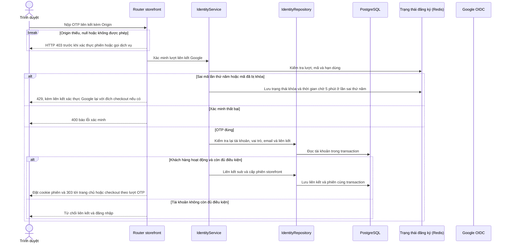

# POST /api/v1/identity/register/google/link/otp

UC-01 E1, AC-16 và UC-02 1d, AC-7, AC-22.

```mermaid
sequenceDiagram
    actor Browser as Trình duyệt
    participant Route as Router storefront
    participant Service as IdentityService
    participant Repo as IdentityRepository
    participant DB as PostgreSQL
    participant Redis as Trạng thái đăng ký (Redis)
    participant Google as Google OIDC
    Browser->>Route: Nộp OTP liên kết kèm Origin
    break Origin thiếu, null hoặc không được phép
        Route-->>Browser: HTTP 403 trước khi xác thực phiên hoặc gọi dịch vụ
    end
    Route->>Service: Xác minh lượt liên kết Google
    Service->>Redis: Kiểm tra lượt, mã và hạn dùng
    alt Sai mã lần thứ năm hoặc mã đã bị khóa
        Service->>Redis: Lưu trạng thái khóa và thời gian chờ 5 phút ở lần sai thứ năm
        Route-->>Browser: 429, kèm liên kết xác thực Google lại với đích checkout nếu có
    else Xác minh thất bại
        Route-->>Browser: 400 báo lỗi xác minh
    else OTP đúng
        Service->>Repo: Kiểm tra lại tài khoản, vai trò, email và liên kết
        Repo->>DB: Đọc tài khoản trong transaction
        alt Khách hàng hoạt động và còn đủ điều kiện
            Service->>Repo: Liên kết sub và cấp phiên storefront
            Repo->>DB: Lưu liên kết và phiên cùng transaction
            Route-->>Browser: Đặt cookie phiên và 303 tới trang chủ hoặc checkout theo lượt OTP
        else Tài khoản không còn đủ điều kiện
            Route-->>Browser: Từ chối liên kết và đăng nhập
        end
    end
```
