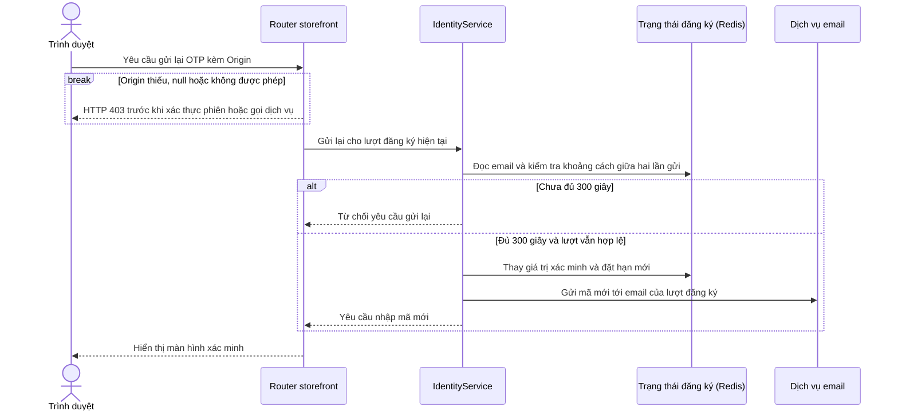

# POST /api/v1/identity/register/otp/resend

UC-01 4a, E5.

```mermaid
sequenceDiagram
    actor Browser as Trình duyệt
    participant Route as Router storefront
    participant Service as IdentityService
    participant Redis as Trạng thái đăng ký (Redis)
    participant Mail as Dịch vụ email
    Browser->>Route: Yêu cầu gửi lại OTP kèm Origin
    break Origin thiếu, null hoặc không được phép
        Route-->>Browser: HTTP 403 trước khi xác thực phiên hoặc gọi dịch vụ
    end
    Route->>Service: Gửi lại cho lượt đăng ký hiện tại
    Service->>Redis: Đọc email và kiểm tra khoảng cách giữa hai lần gửi
    alt Chưa đủ 300 giây
        Service-->>Route: Từ chối yêu cầu gửi lại
    else Đủ 300 giây và lượt vẫn hợp lệ
        Service->>Redis: Thay giá trị xác minh và đặt hạn mới
        Service->>Mail: Gửi mã mới tới email của lượt đăng ký
        Service-->>Route: Yêu cầu nhập mã mới
    end
    Route-->>Browser: Hiển thị màn hình xác minh
```
