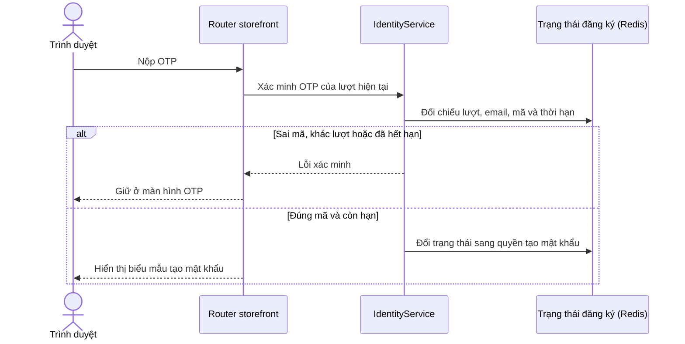

# POST /register/otp

UC-01 Main 4–5, E4.

```mermaid
sequenceDiagram
    actor Browser as Trình duyệt
    participant Route as Router storefront
    participant Service as IdentityService
    participant Redis as Trạng thái đăng ký (Redis)
    Browser->>Route: Nộp OTP
    Route->>Service: Xác minh OTP của lượt hiện tại
    Service->>Redis: Đối chiếu lượt, email, mã và thời hạn
    alt Sai mã, khác lượt hoặc đã hết hạn
        Service-->>Route: Lỗi xác minh
        Route-->>Browser: Giữ ở màn hình OTP
    else Đúng mã và còn hạn
        Service->>Redis: Đổi trạng thái sang quyền tạo mật khẩu
        Route-->>Browser: Hiển thị biểu mẫu tạo mật khẩu
    end
```
