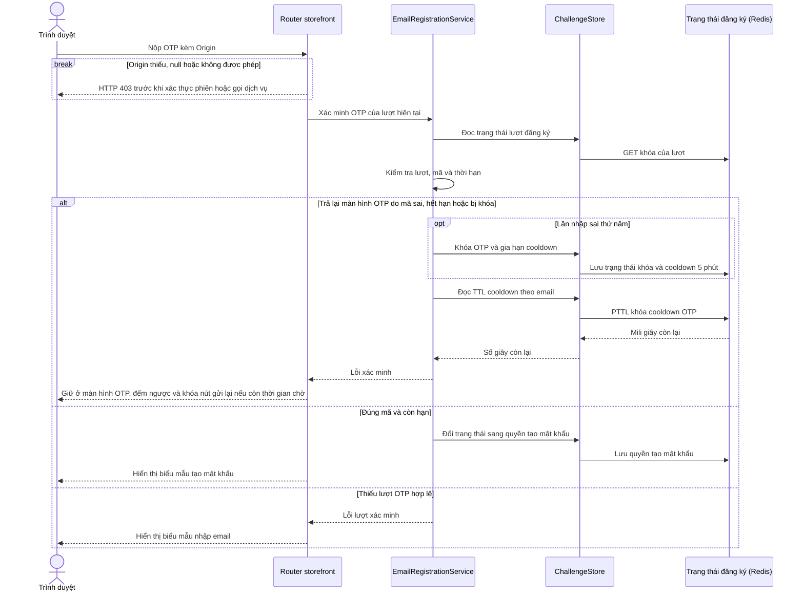

# POST /api/v1/identity/register/otp

UC-01 Main 4–5, E4, AC-17, AC-18.

```mermaid
sequenceDiagram
    actor Browser as Trình duyệt
    participant Route as Router storefront
    participant Service as EmailRegistrationService
    participant Store as ChallengeStore
    participant Redis as Trạng thái đăng ký (Redis)
    Browser->>Route: Nộp OTP kèm Origin
    break Origin thiếu, null hoặc không được phép
        Route-->>Browser: HTTP 403 trước khi xác thực phiên hoặc gọi dịch vụ
    end
    Route->>Service: Xác minh OTP của lượt hiện tại
    Service->>Store: Đọc trạng thái lượt đăng ký
    Store->>Redis: GET khóa của lượt
    Service->>Service: Kiểm tra lượt, mã và thời hạn
    alt Trả lại màn hình OTP do mã sai, hết hạn hoặc bị khóa
        opt Lần nhập sai thứ năm
            Service->>Store: Khóa OTP và gia hạn cooldown
            Store->>Redis: Lưu trạng thái khóa và cooldown 5 phút
        end
        Service->>Store: Đọc TTL cooldown theo email
        Store->>Redis: PTTL khóa cooldown OTP
        Redis-->>Store: Mili giây còn lại
        Store-->>Service: Số giây còn lại
        Service-->>Route: Lỗi xác minh
        Route-->>Browser: Giữ ở màn hình OTP, đếm ngược và khóa nút gửi lại nếu còn thời gian chờ
    else Đúng mã và còn hạn
        Service->>Store: Đổi trạng thái sang quyền tạo mật khẩu
        Store->>Redis: Lưu quyền tạo mật khẩu
        Route-->>Browser: Hiển thị biểu mẫu tạo mật khẩu
    else Thiếu lượt OTP hợp lệ
        Service-->>Route: Lỗi lượt xác minh
        Route-->>Browser: Hiển thị biểu mẫu nhập email
    end
```
