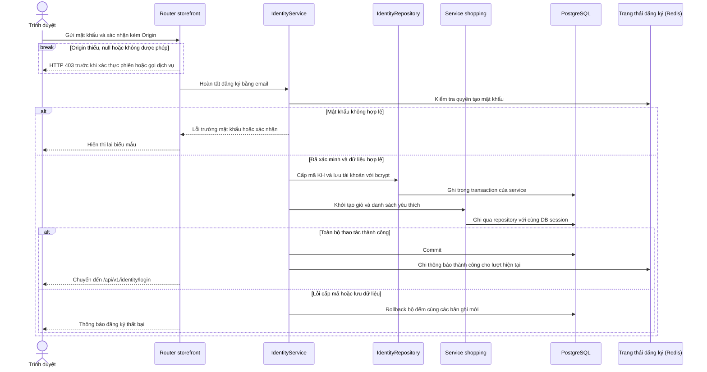

# POST /api/v1/identity/register/password

UC-01 Main 6–8, E6, E7.

```mermaid
sequenceDiagram
    actor Browser as Trình duyệt
    participant Route as Router storefront
    participant Service as IdentityService
    participant Repo as IdentityRepository
    participant Shopping as Service shopping
    participant DB as PostgreSQL
    participant Redis as Trạng thái đăng ký (Redis)
    Browser->>Route: Gửi mật khẩu và xác nhận kèm Origin
    break Origin thiếu, null hoặc không được phép
        Route-->>Browser: HTTP 403 trước khi xác thực phiên hoặc gọi dịch vụ
    end
    Route->>Service: Hoàn tất đăng ký bằng email
    Service->>Redis: Kiểm tra quyền tạo mật khẩu
    alt Mật khẩu không hợp lệ
        Service-->>Route: Lỗi trường mật khẩu hoặc xác nhận
        Route-->>Browser: Hiển thị lại biểu mẫu
    else Đã xác minh và dữ liệu hợp lệ
        Service->>Repo: Cấp mã KH và lưu tài khoản với bcrypt
        Repo->>DB: Ghi trong transaction của service
        Service->>Shopping: Khởi tạo giỏ và danh sách yêu thích
        Shopping->>DB: Ghi qua repository với cùng DB session
        alt Toàn bộ thao tác thành công
            Service->>DB: Commit
            Service->>Redis: Ghi thông báo thành công cho lượt hiện tại
            Route-->>Browser: Chuyển đến /api/v1/identity/login
        else Lỗi cấp mã hoặc lưu dữ liệu
            Service->>DB: Rollback bộ đếm cùng các bản ghi mới
            Route-->>Browser: Thông báo đăng ký thất bại
        end
    end
```
