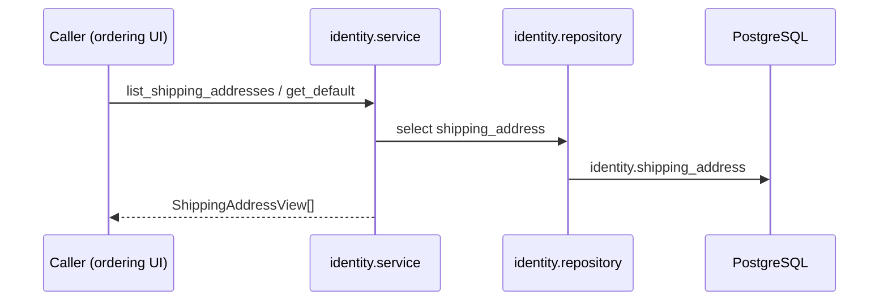
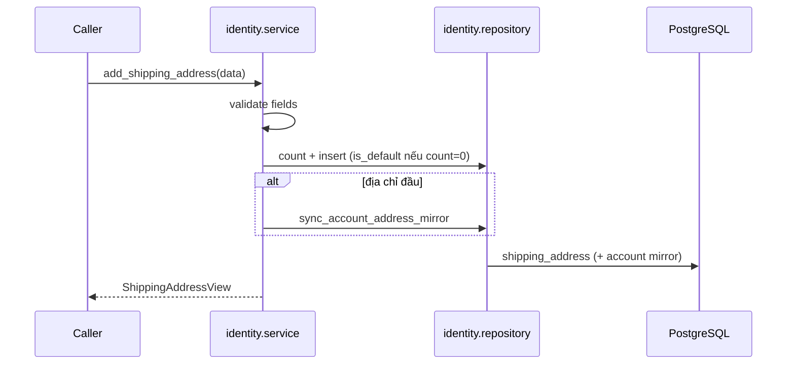
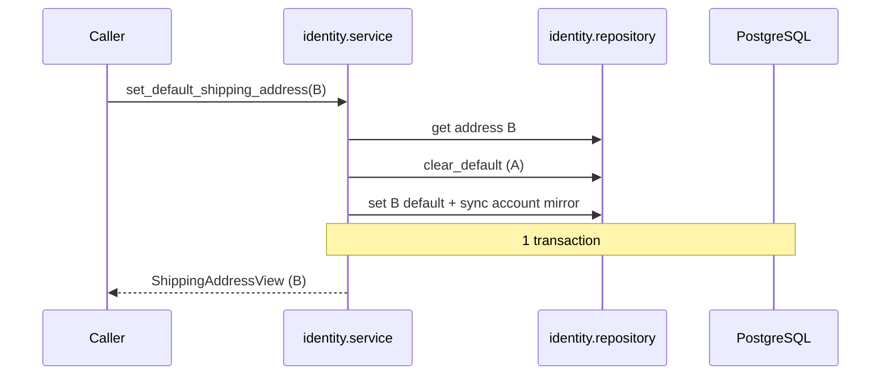

# Sequence — UC-41 sổ địa chỉ (service)

Service công khai identity cho checkout / hồ sơ. Chưa gắn REST production.

## list / get default

```mermaid
sequenceDiagram
  participant C as Caller (ordering UI)
  participant S as identity.service
  participant R as identity.repository
  participant DB as PostgreSQL

  C->>S: list_shipping_addresses / get_default
  S->>R: select shipping_address
  R->>DB: identity.shipping_address
  S-->>C: ShippingAddressView[]
```

## add (địa chỉ đầu = mặc định)

```mermaid
sequenceDiagram
  participant C as Caller
  participant S as identity.service
  participant R as identity.repository
  participant DB as PostgreSQL

  C->>S: add_shipping_address(data)
  S->>S: validate fields
  S->>R: count + insert (is_default nếu count=0)
  alt địa chỉ đầu
    S->>R: sync_account_address_mirror
  end
  R->>DB: shipping_address (+ account mirror)
  S-->>C: ShippingAddressView
```

## set_default

```mermaid
sequenceDiagram
  participant C as Caller
  participant S as identity.service
  participant R as identity.repository
  participant DB as PostgreSQL

  C->>S: set_default_shipping_address(B)
  S->>R: get address B
  S->>R: clear_default (A)
  S->>R: set B default + sync account mirror
  Note over S,DB: 1 transaction
  S-->>C: ShippingAddressView (B)
```
