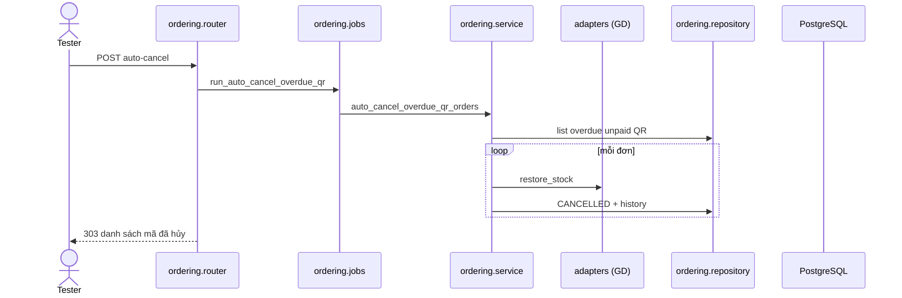

# Sequence — POST /dev/ordering/staff/auto-cancel

```mermaid
sequenceDiagram
  actor U as Tester
  participant R as ordering.router
  participant J as ordering.jobs
  participant S as ordering.service
  participant A as adapters (GD)
  participant Repo as ordering.repository
  participant DB as PostgreSQL

  U->>R: POST auto-cancel
  R->>J: run_auto_cancel_overdue_qr
  J->>S: auto_cancel_overdue_qr_orders
  S->>Repo: list overdue unpaid QR
  loop mỗi đơn
    S->>A: restore_stock
    S->>Repo: CANCELLED + history
  end
  R-->>U: 303 danh sách mã đã hủy
```
