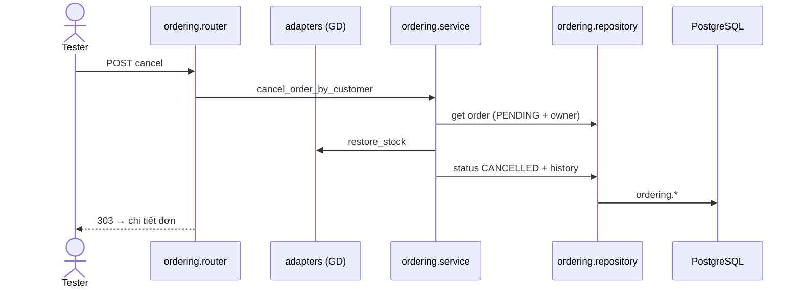

# Sequence — POST /dev/ordering/orders/{code}/cancel

```mermaid
sequenceDiagram
  actor U as Tester
  participant R as ordering.router
  participant A as adapters (GD)
  participant S as ordering.service
  participant Repo as ordering.repository
  participant DB as PostgreSQL

  U->>R: POST cancel
  R->>S: cancel_order_by_customer
  S->>Repo: get order (PENDING + owner)
  S->>A: restore_stock
  S->>Repo: status CANCELLED + history
  Repo->>DB: ordering.*
  R-->>U: 303 → chi tiết đơn
```
