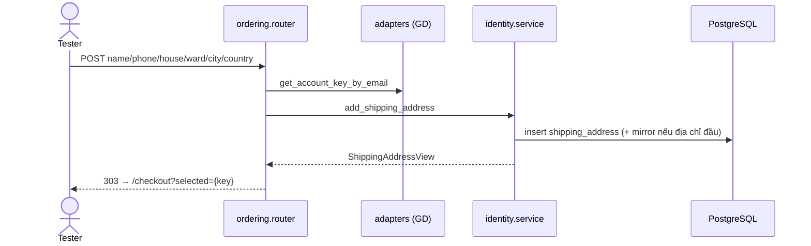

# Sequence — POST /dev/ordering/checkout/addresses

Thêm địa chỉ tại checkout (UC-19 AC-13 / UC-41). Lưu sổ rồi chọn cho đơn đang đặt.

```mermaid
sequenceDiagram
  actor U as Tester
  participant R as ordering.router
  participant A as adapters (GD)
  participant Id as identity.service
  participant DB as PostgreSQL

  U->>R: POST name/phone/house/ward/city/country
  R->>A: get_account_key_by_email
  R->>Id: add_shipping_address
  Id->>DB: insert shipping_address (+ mirror nếu địa chỉ đầu)
  Id-->>R: ShippingAddressView
  R-->>U: 303 → /checkout?selected={key}
```
