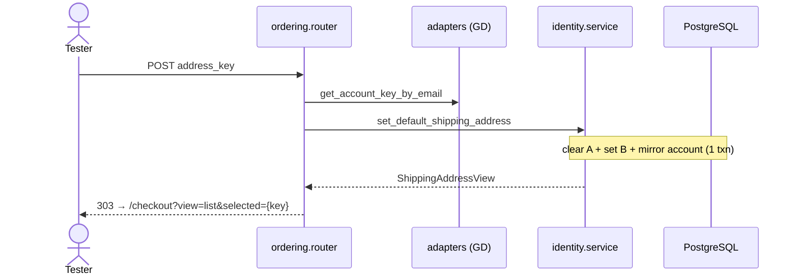

# Sequence — POST /dev/ordering/checkout/addresses/default

Đặt địa chỉ mặc định từ sheet sổ tại checkout (UC-41 AC-3).

```mermaid
sequenceDiagram
  actor U as Tester
  participant R as ordering.router
  participant A as adapters (GD)
  participant Id as identity.service
  participant DB as PostgreSQL

  U->>R: POST address_key
  R->>A: get_account_key_by_email
  R->>Id: set_default_shipping_address
  Note over Id,DB: clear A + set B + mirror account (1 txn)
  Id-->>R: ShippingAddressView
  R-->>U: 303 → /checkout?view=list&selected={key}
```
