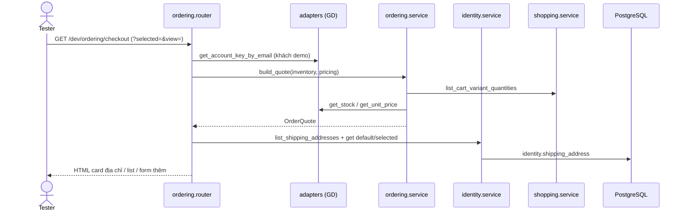

# Sequence — GET /dev/ordering/checkout

UI thử (feature/ordering). Actor: developer / tester.

Prefill địa chỉ mặc định từ sổ identity (UC-19 AC-12 / UC-41).

```mermaid
sequenceDiagram
  actor U as Tester
  participant R as ordering.router
  participant A as adapters (GD)
  participant S as ordering.service
  participant Id as identity.service
  participant Shop as shopping.service
  participant DB as PostgreSQL

  U->>R: GET /dev/ordering/checkout (?selected=&view=)
  R->>A: get_account_key_by_email (khách demo)
  R->>S: build_quote(inventory, pricing)
  S->>Shop: list_cart_variant_quantities
  S->>A: get_stock / get_unit_price
  S-->>R: OrderQuote
  R->>Id: list_shipping_addresses + get default/selected
  Id->>DB: identity.shipping_address
  R-->>U: HTML card địa chỉ / list / form thêm
```
