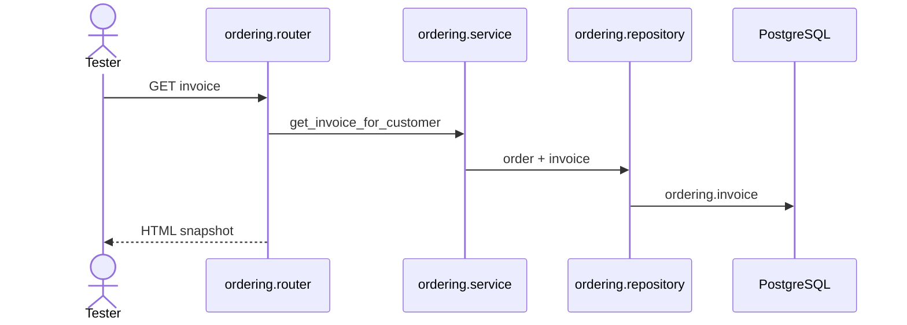

# Sequence — GET /dev/ordering/orders/{code}/invoice

```mermaid
sequenceDiagram
  actor U as Tester
  participant R as ordering.router
  participant S as ordering.service
  participant Repo as ordering.repository
  participant DB as PostgreSQL

  U->>R: GET invoice
  R->>S: get_invoice_for_customer
  S->>Repo: order + invoice
  Repo->>DB: ordering.invoice
  R-->>U: HTML snapshot
```
