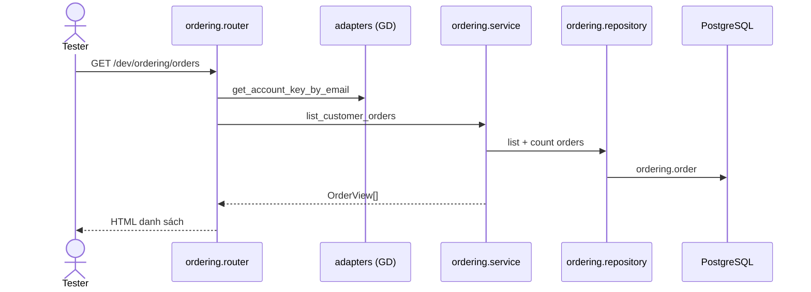

# Sequence — GET /dev/ordering/orders

```mermaid
sequenceDiagram
  actor U as Tester
  participant R as ordering.router
  participant A as adapters (GD)
  participant S as ordering.service
  participant Repo as ordering.repository
  participant DB as PostgreSQL

  U->>R: GET /dev/ordering/orders
  R->>A: get_account_key_by_email
  R->>S: list_customer_orders
  S->>Repo: list + count orders
  Repo->>DB: ordering.order
  S-->>R: OrderView[]
  R-->>U: HTML danh sách
```
