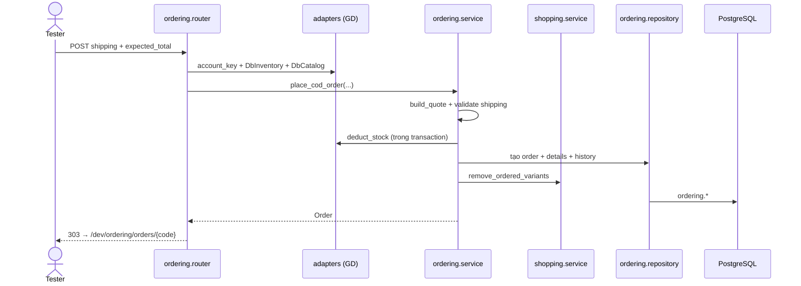

# Sequence — POST /dev/ordering/checkout/cod

UI thử (feature/ordering). Actor: developer / tester.

```mermaid
sequenceDiagram
  actor U as Tester
  participant R as ordering.router
  participant A as adapters (GD)
  participant S as ordering.service
  participant Shop as shopping.service
  participant Repo as ordering.repository
  participant DB as PostgreSQL

  U->>R: POST shipping + expected_total
  R->>A: account_key + DbInventory + DbCatalog
  R->>S: place_cod_order(...)
  S->>S: build_quote + validate shipping
  S->>A: deduct_stock (trong transaction)
  S->>Repo: tạo order + details + history
  S->>Shop: remove_ordered_variants
  Repo->>DB: ordering.*
  S-->>R: Order
  R-->>U: 303 → /dev/ordering/orders/{code}
```
