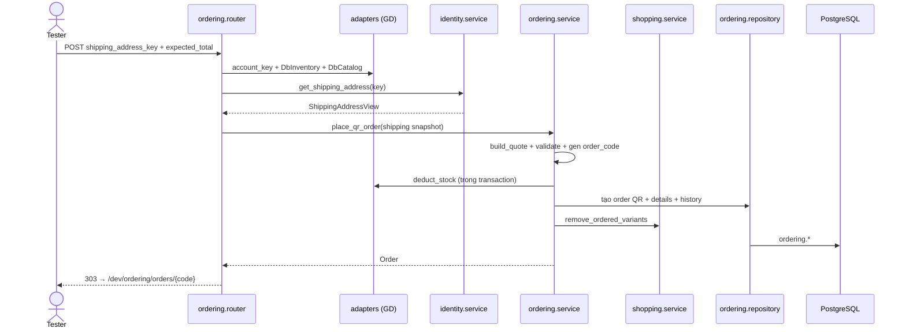

# Sequence — POST /dev/ordering/checkout/qr

UI thử (feature/ordering). Actor: developer / tester.

Cùng snapshot sổ địa chỉ như COD; sau khi tạo đơn hiển thị VietQR trên chi tiết đơn.

```mermaid
sequenceDiagram
  actor U as Tester
  participant R as ordering.router
  participant A as adapters (GD)
  participant Id as identity.service
  participant S as ordering.service
  participant Shop as shopping.service
  participant Repo as ordering.repository
  participant DB as PostgreSQL

  U->>R: POST shipping_address_key + expected_total
  R->>A: account_key + DbInventory + DbCatalog
  R->>Id: get_shipping_address(key)
  Id-->>R: ShippingAddressView
  R->>S: place_qr_order(shipping snapshot)
  S->>S: build_quote + validate + gen order_code
  S->>A: deduct_stock (trong transaction)
  S->>Repo: tạo order QR + details + history
  S->>Shop: remove_ordered_variants
  Repo->>DB: ordering.*
  S-->>R: Order
  R-->>U: 303 → /dev/ordering/orders/{code}
```
